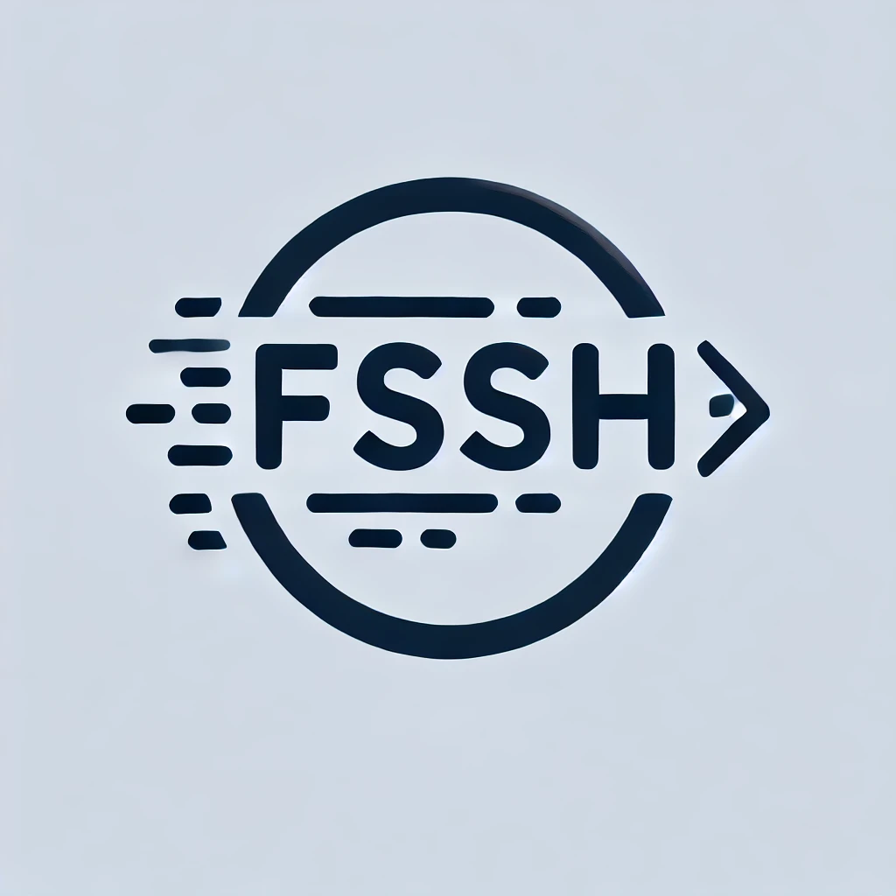

<div align="center">
     <!-- Replace with the actual path to the logo -->
    <br/>
    <b>Connect quickly to your SSH servers 🚀</b>
    <br/>
    <br/>
    <a href="https://github.com/gvariable/fssh/actions/workflows/release.yml">
        
    </a>
    </a>
    
    <br/>
    <br/>
    <div>
        FSSH is a TUI tool that allows you to quickly connect to your SSH servers by navigating through your SSH config.
    </div>
    <br/>
</div>

# FSSH

A CLI tool for quickly connecting to SSH servers with an intuitive TUI interface.


Require password entry only **once**!

## Features

- Intuitive TUI interface for **selecting and searching** from a large list of SSH servers.
- Automatically **memorizes** and encrypts passwords, requiring password entry only **once**.

## Installation

No release is available yet, so you will need to download and compile the project manually.

```shell
git clone https://github.com/gvariable/fssh.git
cd fssh
cargo run
```

## How It Works

1. `fssh` parses your `~/.ssh/config` file and lists all the hosts.
2. Users can search for and select the host they want to connect to.
3. `fssh` spawns a new TTY and runs the SSH client to connect to the chosen host.
4. If the host requires a password, `fssh` will memorize and encrypt it locally. The default configuration location is `~/Library/Application Support/fssh` on macOS and `~/.config/fssh` on Linux. The next time the user connects to the same host, they won't need to enter the password again.
5. If the host doesn't require a password, `fssh` will connect directly.

## Known issues
The pseudo terminal currently does not support scrollback, so users cannot view the command history. 